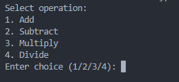

# Basic Calculator

## Description
The Basic Calculator performs simple arithmetic operations such as addition, subtraction, multiplication, and division. Learning how to implement a basic calculator helps to understand fundamental programming concepts such as functions and user input.

## Table of Contents
1. [Description](#description)
2. [Installation](#installation)
3. [Usage](#usage)
4. [Credits](#credits)

## Installation
To run this project locally, follow these steps:

1. Clone the repository:
    ```bash
    git clone https://github.com/jman9201/codingTasks.git
    cd codingTasks/BasicCalculator
    ```

2. Ensure you have Python installed. If not, download and install Python from [python.org](https://www.python.org/).

## Usage
To use the Basic Calculator:

1. Navigate to the project directory:
    ```bash
    cd BasicCalculator
    ```

2. Run the program:
    ```bash
    python basic_calculator.py
    ```

3. Follow the prompts to perform calculations.

### Screenshot


## Credits
Developed by [James Man](https://github.com/jman9201).
