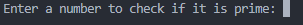

# Prime Number Checker

## Description
The Prime Number Checker is a simple program that determines whether a given number is a prime number. Understanding prime numbers and how to check for them is fundamental in various areas of computer science and mathematics.

## Table of Contents
1. [Description](#description)
2. [Installation](#installation)
3. [Usage](#usage)
4. [Credits](#credits)

## Installation
To run this project locally, follow these steps:

1. Clone the repository:
    ```bash
    git clone https://github.com/jman9201/codingTasks.git
    cd codingTasks/PrimeNumberChecker
    ```

2. Ensure you have Python installed. If not, download and install Python from [python.org](https://www.python.org/).

## Usage
To use the Prime Number Checker:

1. Navigate to the project directory:
    ```bash
    cd PrimeNumberChecker
    ```

2. Run the program:
    ```bash
    python prime_number_checker.py
    ```

3. Enter a number when prompted to check if it is a prime number.

### Screenshot


## Credits
Developed by [James Man](https://github.com/jman9201).
